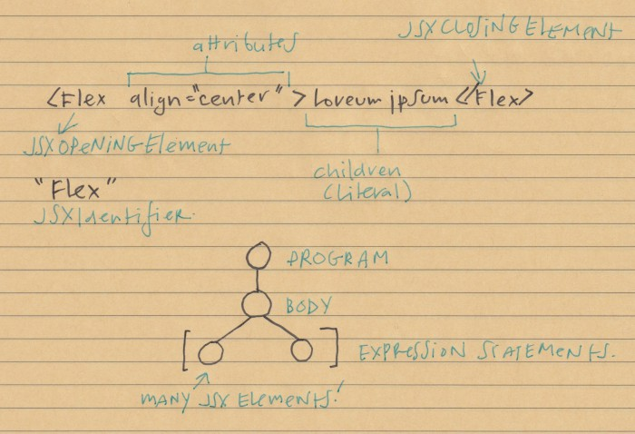
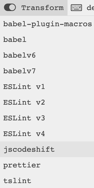
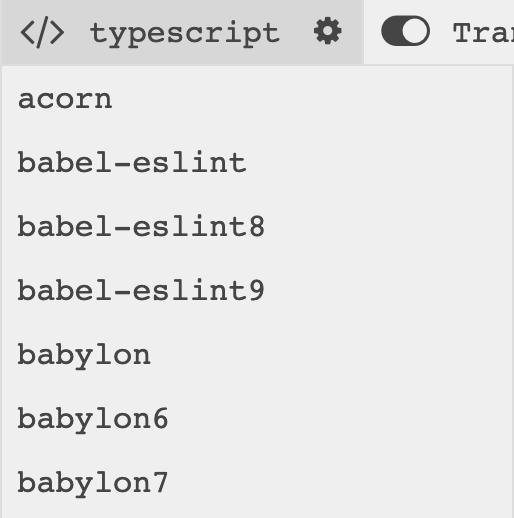
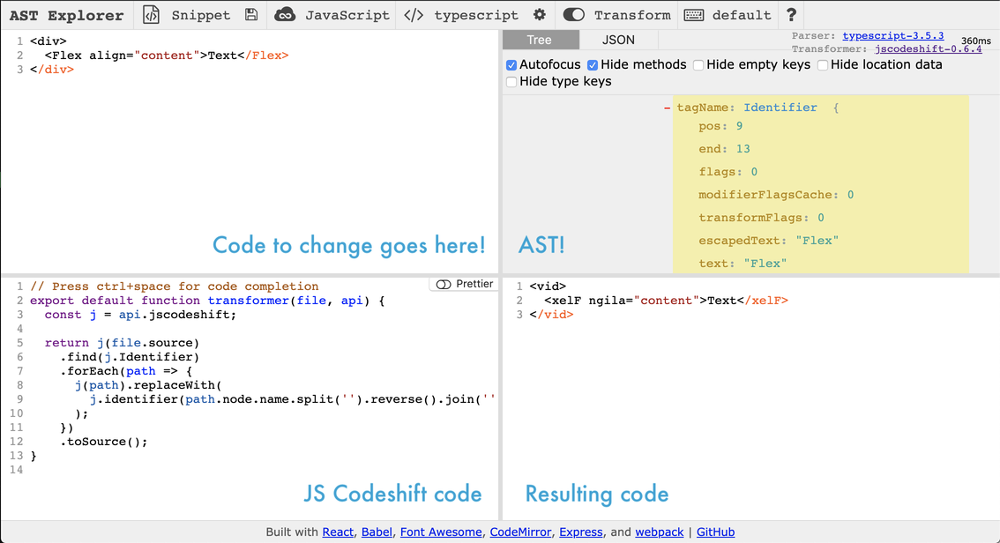

A few years back I got interested in codemods and learning more about AST (Abstract syntax trees). Articles like Vaidehi Joshi's [Leveling Up One’s Parsing Game With ASTs](https://medium.com/basecs/leveling-up-ones-parsing-game-with-asts-d7a6fc2400ff) and [The super tiny compiler](https://github.com/jamiebuilds/the-super-tiny-compiler) were inspiring to me.

In my day to day work, I couldn’t see the immediate use of learning about ASTs. Learning to write my own codemod seemed hopelessly out of reach to me.

This changed a few weeks ago when I discovered [Ast Explorer](https://astexplorer.net/). It's an online REPL where you can try out using jscodeshift and other transformers like Babel and eslint.

### What is a codemod?
A codemod is a tool to change your code. 
### What is an AST
An Abstract syntax tree is just your code broken down into a tree structure. In Javascript, this means an object with other objects and arrays nested inside.

It's easier to show you in a picture, so here:



At the top of the tree is **the program**. The program contains **the body**, and inside of the body are many **expression statements**.

In the example above, there is a **JSX Element**. This has which usually have **opening** and **closing** elements. Each element has **attributes** (React props) and **children**. Children is just dummy text (text is known as a **Literal**), but children can also be other JSX Elements.
### What is jscodeshift?
jscodeshift is a toolkit for modifying code (aka running codemods).

### Why does all of this matter anyways?
Codemods really shine when you need to do find-and-replace of elements that are similar, but slightly different. 

As an example, say I want to change every instance of **align** to **alignContent**, but only in the Flex elements below:

```HTML
<Flex align="center">Loreum Ipsum</Flex>
<Box align="center">This is a box!</Box>
<Flex marginTop="some-space" align="center">Loreum more ipsum</Flex>
```

If you have ever done a find-and-replace, either with or without regex, you can see that this is difficult. 

First of all, if you just do a global find-and-replace, you will replace the **align** attribute in **Box** also, which is not what you want. 

Secondly if the attributes in Flex occur in different order, writing a regex to just find **align** is going to be time consuming, to say the least.

However, with the power of Abstract Syntax Trees and jscodeshift, modifying your code is as easy as using **find** (to find the right JSX), **filter** (to filter out the attribute that you want to replace) and **forEach** (to replace each attribute with the name you want).
### Using AST explorer
First, go to [AST explorer](https://astexplorer.net/) and set your transform to **jscodeshift**:



Next, set the parser to something that accepts **jsx**, like **babel** or **typescript**:



Below you can see the setup of what goes where:


### Setting up jscodeshift

The base setup looks like this:

```Javascript
export default (file, api) => {
  var j = api.jscodeshift; // alias the jscodeshift API
  var root = j(file.source); // parse JS code into an AST

  return root.toSource();
};
```

This creates a module that takes your source code, applies jscodeshift to the code, and returns the result. In this case jscodeshift is not doing anything yet.
### Find the element you want to change.

I want to change the attributes on the opening element of any JSXElement (I have never seem props on a closing element, so I am assuming that I am looking at opening elements only):

```Javascript
root
.find(j.JSXElement, {
    openingElement: { name: { name: "Flex" } }
})
.forEach(update);
```

What the above code does, is that is finds every **JSXOpeningElement** called **Flex** and runs an update method (TBD) on every **node path**.
### What are node paths?
**Node paths** are just Javascript objects that are wrapped around AST Nodes. You can use Node path to access the parent objects (like Program), and the name of the current node. 

Node Paths also has convenience methods like **get**, **replace**, **insertBefore**, and **insertAfter**.
### What are collections?
Collections are just groups of node paths. Because they are in groups (arrays), you get access to nice methods like **filter**, **forEach**, **map**, **size** and **at**.

### Modifying collections
If you poke about the Abstract Syntax Tree in AST Explorer, you will see that every **JSXOpeningElement** has a collection of **attributes**. These attributes are React props.

Changing the name of the **align** attribute to **alignContent** is as simple as using **filter** (to find the attribute) and **forEach** (to change it to something else):

```Javascript
const update = path => {
    const Node = path.value;

    Node.openingElement.attributes
        .filter(obj => obj.name.name === "align")
        .forEach(item => {
        item.name.name = "alignContent";
        });
    };
};
```

## TL;DR
The first few react codemods came out about two years ago, and I had hit and miss results with these. Sometimes it changed my code in the way I wanted, sometimes it did not. Also, some of the codemods were things I could do with just find and replace, so I felt pretty skeptical.

What codemods are really great at, however, is doing find-and-replace in your own codebase. Many changes you will want to do are specific to the code you have written. Rather than do basic find-and-replace, or find-and-replace with regexes, it's easier to create an abstract syntax tree of your code. This makes selecting of specific parts of your code easier.

jscodeshift wraps nodes in an abstract syntax tree with node paths, which are just Javascript objects with lots of helper functions to make it simple to modify your code.

Using jscodeshift is more about having a mental model of the abstract syntax tree of your code (draw a picture if you need to! It helps!) and then using familiar methods like **find**, **filter**, **forEach** and **replace** to change what you want to change.

For the complete code in this post, [check out this gist](https://astexplorer.net/#/gist/f98a6e68eb196e7161a5a2c096c035e5/9df530e022ecc48ea7d0561ae5dec3b0dc4c3ab0)


