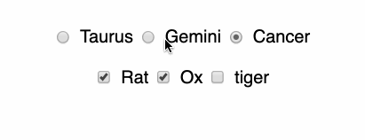

Lately (as in, for years) I have been creating and maintaining a lot of form fields in React. 

Form fields, at a glance, seem easy enough, but when it comes to breaking down a design into something to build in React, it takes a lot of careful thought. 

I think a good first step is to think of your form elements as a combination of HTML and Javascript, not as React elements.

### Radio buttons are for "choose one only", checkboxes are for "choose many"

Radio buttons should be used when you want the user to only be able to choose one option of many.

Checkboxes should be used when you want the user to choose many options.



This sounds simple enough, but it does happen now and then that a designer or product owner will pick the wrong form field type. For example, they will show checkboxes in a design when they really want to limit the user to being able to choose one option!

### Radio buttons work with strings, checkboxes work with booleans

When you are making controlled components in React, be aware that values passed into a radio button will be converted to a string.

This becomes an issue, when say, your designer is using a set of radio buttons to toggle some other component view.

If you pass a boolean into a radio input, **true** will become **"true"** and you will experience all sorts of headaches if you don't know that this is what is happening. Your toggle will not work if you are checking for a certain radio button being **true** instead of the string value of radio input.

If you have a nicely styled toggle switch, it should be built with a checkbox and that should be used to toggle a view on and off (not a radio button!)

### Both radio buttons and checkboxes have a checked value
To mark either radio buttons and checked boxes as checked, there is an attribute called **checked**.

### Name attributes mean different things in groups versus single items
You can have groups of radio buttons, and groups of checkboxes. To indicate something is a group, use the same **name** for each item:

```HTML
<input type="radio" name="astrology" value="taurus"><label>Taurus</label>
<input type="radio" name="astrology" value="gemini"><label>Gemini</label>
<input type="radio" name="astrology" value="cancer"><label>Cancer</label>
```

For non-grouped checkboxes or radio buttons, just have unique names.

```HTML
<input type="checkbox" name="taurus"><label>Taurus</label>
<input type="checkbox" name="gemini"><label>Gemini</label>
<input type="checkbox" name="cancer"><label>Cancer</label>
```


