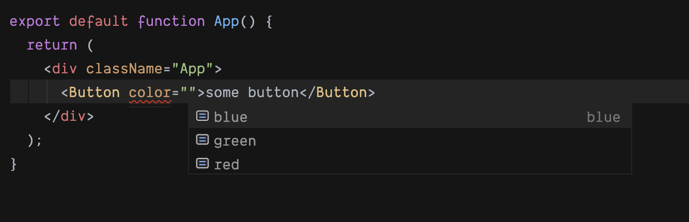
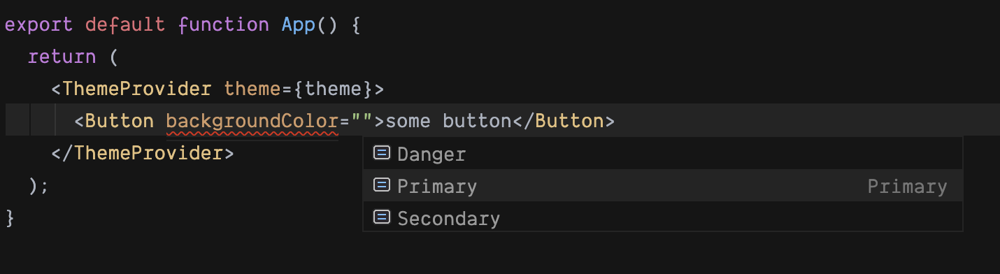

With Typescript the **union** type allows one to have better intellisense for the components you create.

As a very simplified example:

```jsx
type ButtonProps = {
  color?: "red" | "blue" | "green",
}

const Button: React.FunctionComponent<ButtonProps> = props => (
  <button style={{ backgroundColor: props.color }}>{props.children}</button>
)
```



[](https://codesandbox.io/s/hintingwithtype-r3rk2?fontsize=14&hidenavigation=1&theme=dark)

Note: the red underline goes away when you actually pick an option.

Using the `|` union operator will allow `red`, `blue`, or `green` but not say, `yellow` or `purple`.

But what happens if we're using components that have a theme, with something like [styled-system](https://styled-system.com/) or [theme-ui](https://theme-ui.com/)? Or even, what if we want the string `red` to be something more like a role name, like `PrimaryButtonBackground`?

A theme is an object that maps names (strings) to values. In the case of colours, it's the hex codes:

```js
const theme = {
  colors: {
    Primary: "#4ec9ff",
    Secondary: "#ffc139",
    Danger: "#ff8150",
  },
}
```

When using a styled function, like emotion:

```jsx
type ButtonProps = {
  backgroundColor?: "Primary" | "Secondary" | "Danger",
}

const Button =
  styled.button <
  ButtonProps >
  `
  ${color}
`
```

The resulting intellisense hinting:



[](https://codesandbox.io/s/typehintingstyledsystem-4mxl8?fontsize=14&hidenavigation=1&theme=dark)
